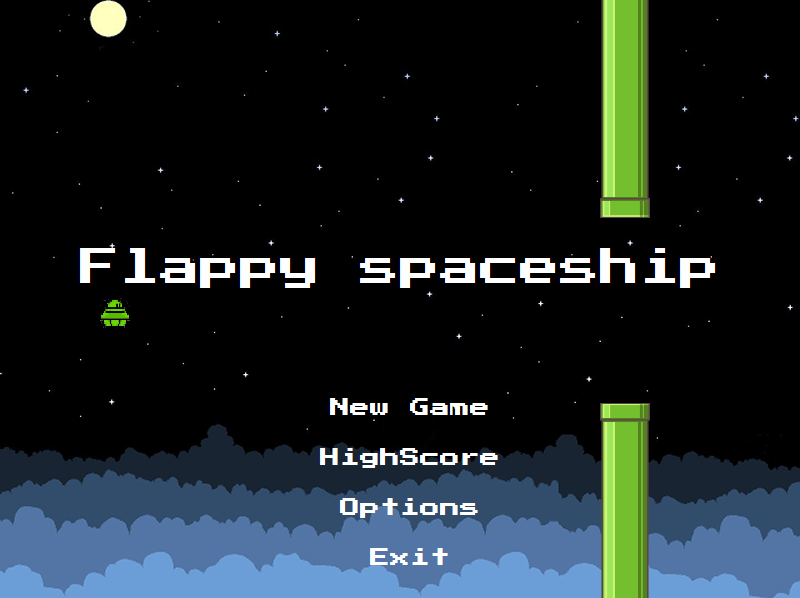
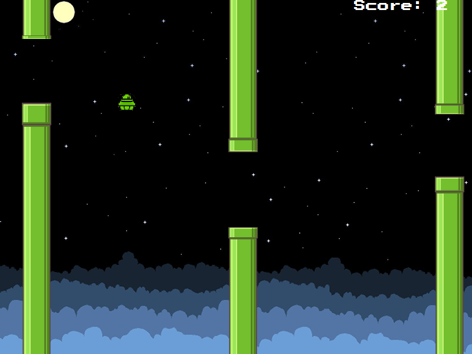

**Flappy SpaceShip**
===================

This is an implementation of Flappy Bird using the JavaFX platform.

Like the original, the user must use the space bar in order to flap the ship  to fly, while avoiding being hit by pipes, whose heights are randomly generated.

